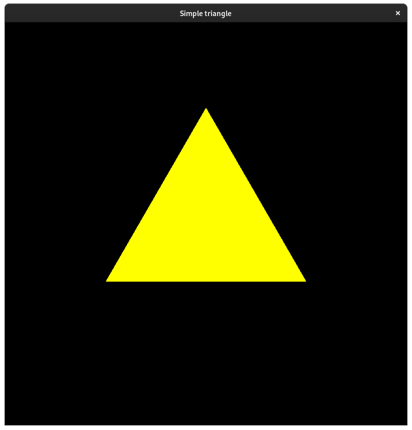
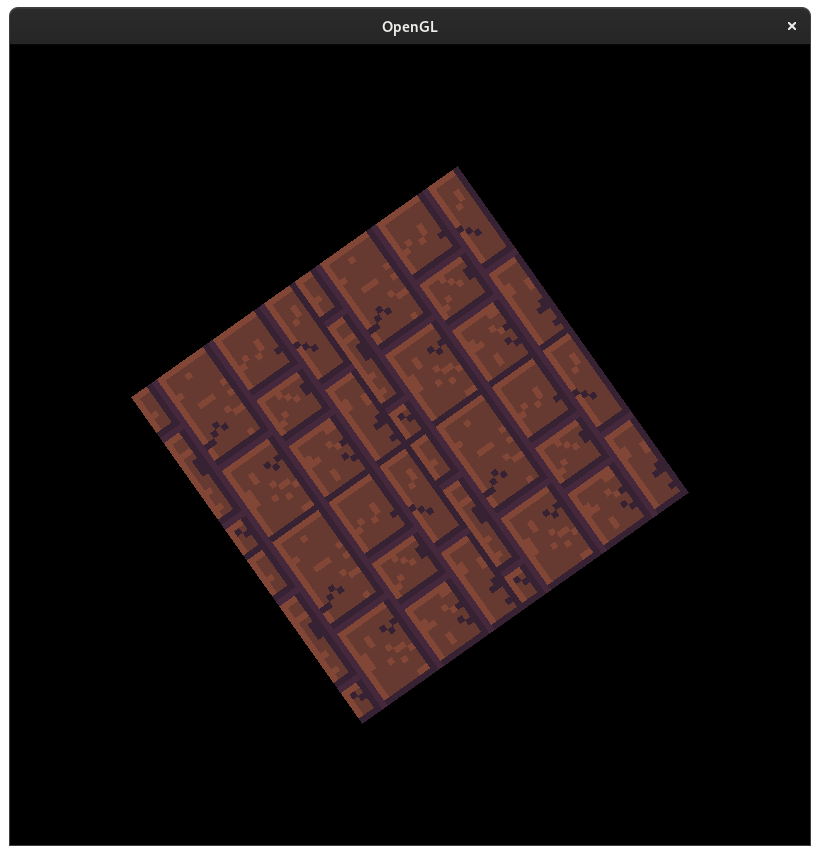
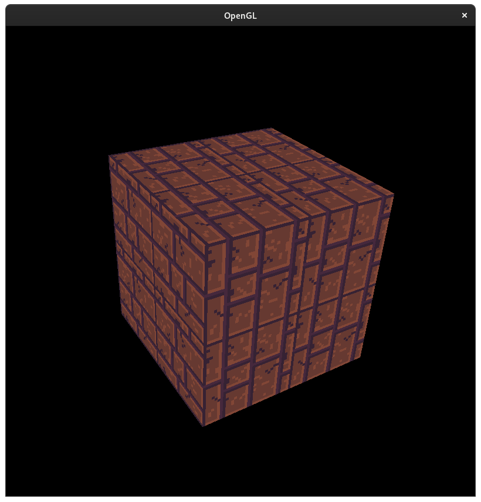
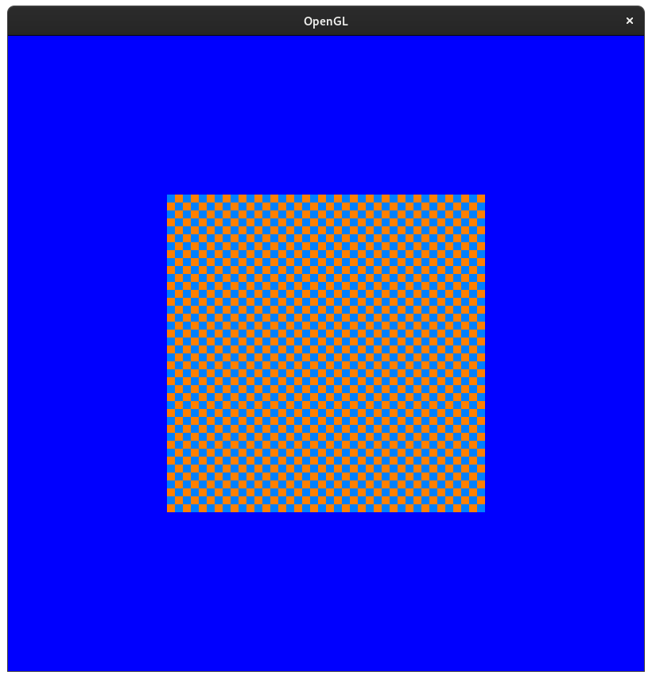
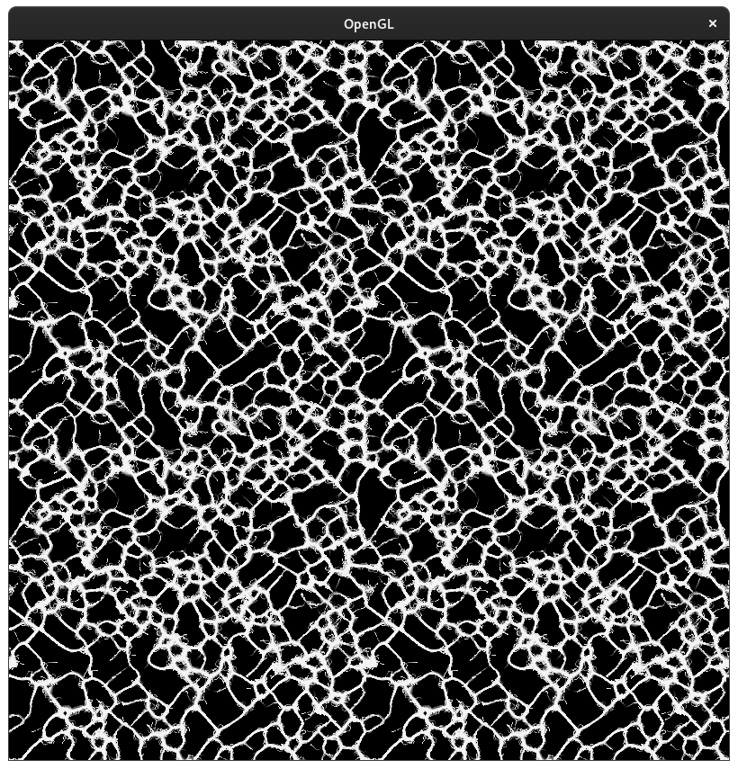

# OpenGL training

This is just the projects that I've done to learn own to use OpenGL. I've posted them here in case someone wants some OpenGL examples.

## Used resource

Project(s) | Resource
--- | ---
01-04 | https://www.youtube.com/watch?v=XpBGwZNyUh0&list=PLPaoO-vpZnumdcb4tZc4x5Q-v7CkrQ6M-
05 | https://zestedesavoir.com/tutoriels/1554/introduction-aux-compute-shaders/
06 | https://github.com/SebLague/Slime-Simulation
08-10 | https://www.youtube.com/watch?v=XpBGwZNyUh0&list=PLPaoO-vpZnumdcb4tZc4x5Q-v7CkrQ6M-

## Projects

### 01 - Simple triangle

This is the basic of OpenGL, just a triangle.

### 02 - simple triangle organised

The result is the same as the previous one, but the code is organised.

### 03 - Simple texture

I started working on texture. I display a texture on a quad and the quad rotate thanks to a uniform.

### 04 - Rotating cube

Same as the previous one but in 3D.

### 05 - Compute shader

Use a Compute shader to generate a texture.

### 06 - Slime simulation

A slime simulation made with Compute shader.

### 07 - Slime simulation organised

Same as the previous one but the code as been organised to simplify the management of compute shader.

### 08 - Camera movement

A cube and camera movement controller to move.

### 09 - Light

A cube and a light source. The type of the light can be change by changing the function use by basic.frag. There is 3 light source type:
* spotlight
* direct light
* point light

### 10 - Mesh

Add a Mesh class and a Model class to load 3D model.